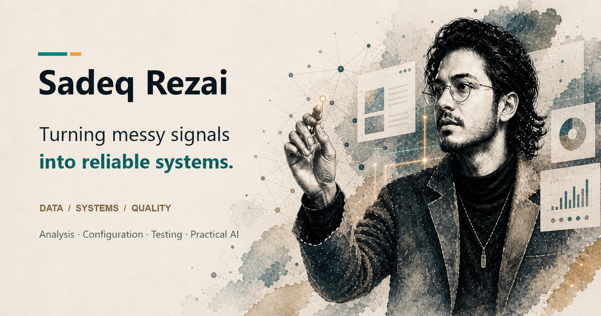

# Sadeq Rezai — The Working Studio

[Visit the portfolio](https://rammeshgar.github.io/)

An editorial, paper-cut portfolio presenting configuration, quality engineering, data products and practical AI work.

## Experience

- Responsive ivory, forest-green and copper design with project case studies.
- Scroll-driven original hero film: 158 frames, responsive image sizes, buffered loading and single-frame rendering without crossfade ghosting.
- On-demand Three.js assistant with a paper-cut avatar, studio scene, blended gesture library, subtle torso and shoulder movement, and independent blinking.
- Text and voice interface, clear microphone invitation, speaker/mute controls and accessible focus states.
- Distinct email and copy-email actions; footer spacing accommodates the floating assistant.

## Running locally

Serve the repository with any static HTTP server. No frontend build is required.

The assistant uses the existing Netlify service. Its origin allowlist may reject localhost requests; live assistant testing must use the approved production origin. API secrets belong on the backend, never in this repository.

## Motion and performance

The avatar is loaded only when requested and targets 30 fps. Motion respects reduced-motion preferences. Gesture blending and breathing are implemented in `avatar/movement.mjs` and `avatar/presence.mjs`, not baked into every animation clip. The full-detail avatar is approximately 20.6 MB; performance depends on hardware and network conditions. Lip synchronization is approximate, not phoneme-perfect.

Existing legacy assets are retained for compatibility. The current entry point uses `production.css`, `production.mjs`, `hero-scroll.mjs`, `hero-frames/`, `assets/` and `avatar/`.
